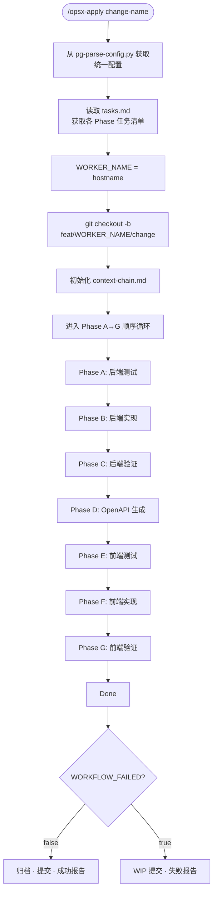
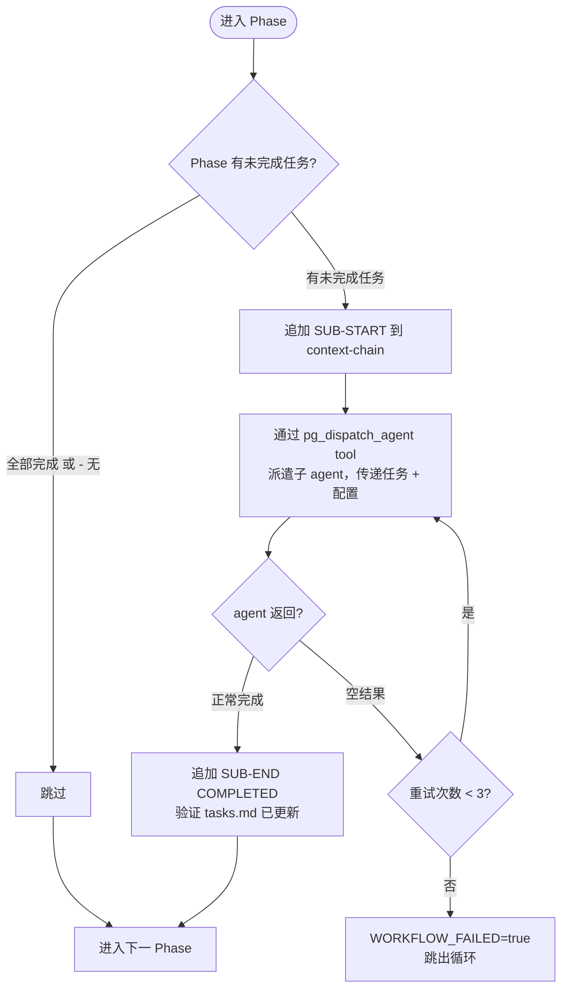
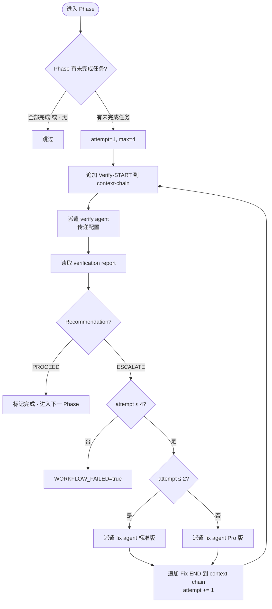
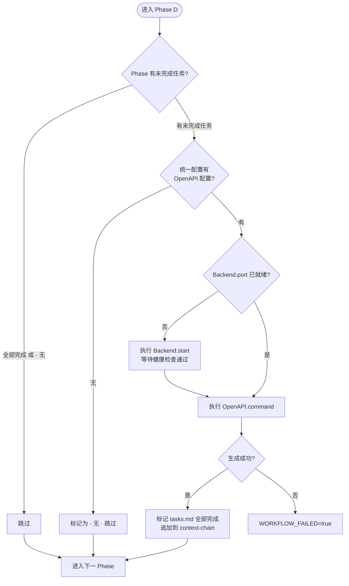
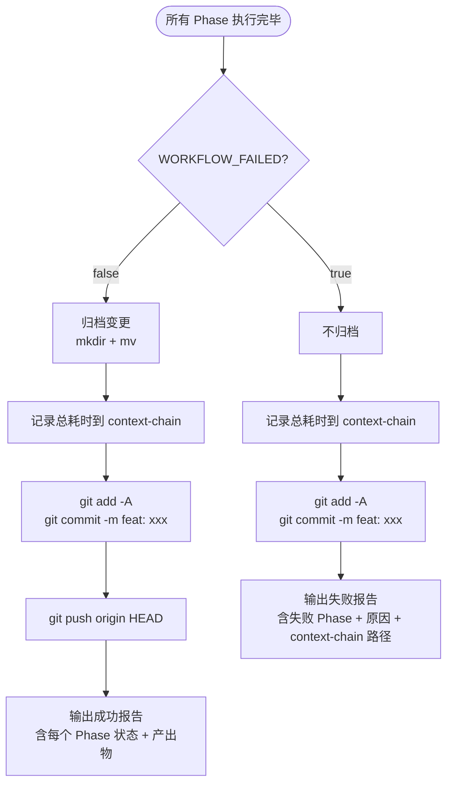

# pg-apply-change 工作流图

## 1. 整体编排流程

## 2. Phase A/B/E/F — 简单派遣

## 3. Phase C/G — 验证派遣 (verify→fix 循环)

## 4. Phase D — 编排器自执行 (OpenAPI 生成)

## 5. 收尾处理

## 各图对应关系

| 图 | 覆盖范围 | 对应 SKILL 章节 |
|----|---------|----------------|
| 1. 整体编排 | 全局流程概览 | 编排器执行工作流 |
| 2. 简单派遣 | Phase A/B/E/F 内部逻辑 | 简单派遣 |
| 3. 验证派遣 | Phase C/G verify→fix 循环 | 验证派遣 + 异常处理 |
| 4. 自执行 | Phase D OpenAPI 生成 | 编排器自执行 |
| 5. 收尾处理 | 成功/失败后的操作 | 完成处理 |
